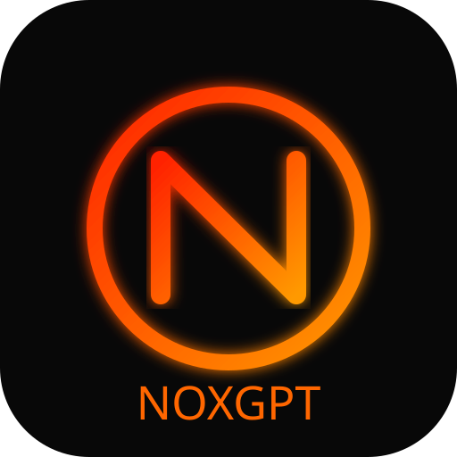

#  NOXGPT

<p align="center">
  
</p>

<h2 align="center">NOXGPT</h2>

<p align="center">
AI Chat hiện đại với giao diện LED đỏ/cam lấy cảm hứng từ các công cụ AI chuyên nghiệp.
</p>

---

##  Tính năng

-  Chat AI thông minh
-  Hiệu ứng AI đang suy nghĩ
-  Giao diện LED đỏ/cam
-  Dark Mode
-  Tối ưu điện thoại
-  Hiệu ứng gõ chữ
-  Hỗ trợ Avatar
-  Markdown
-  Copy Code
-  Lưu lịch sử chat
-  Responsive

---

##  Cấu trúc Project

```
/
│
├── index.html
├── ai.html
├── ai.css
├── ai.js
├── README.md
│
└── assets
    ├── logo.svg
    ├── avatar-ai.png
    ├── avatar-user.png
    └── bg.webp
```

---

##  Cài đặt

Clone project

```bash
git clone https://github.com/dienmayxanhdmx0999-commits/skibidiscript.git
```

Mở

```
ai.html
```

hoặc

```
index.html
```

---

##  Giao diện

- Dark Theme
- Orange Neon
- Smooth Animation
- Typing Effect
- Thinking Animation
- AI Avatar
- User Avatar

---

##  Phiên bản

NOXGPT v1.0

---

## Developer

DVMinh

---

##  Lưu ý

Không đưa API Key lên GitHub nếu repository để Public.

---

<p align="center">
Made by DVMinh
</p>
